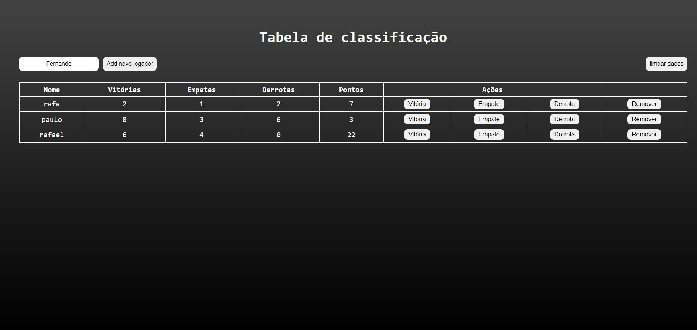
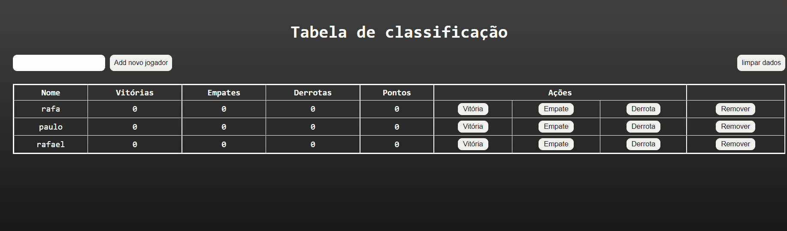
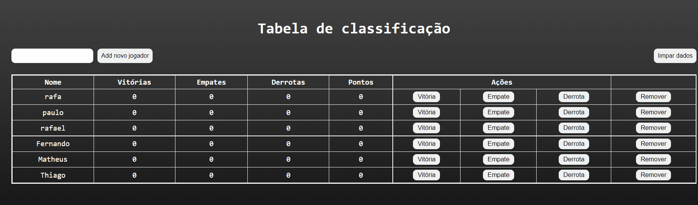
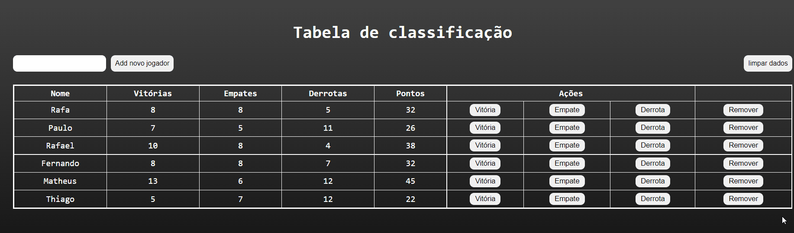
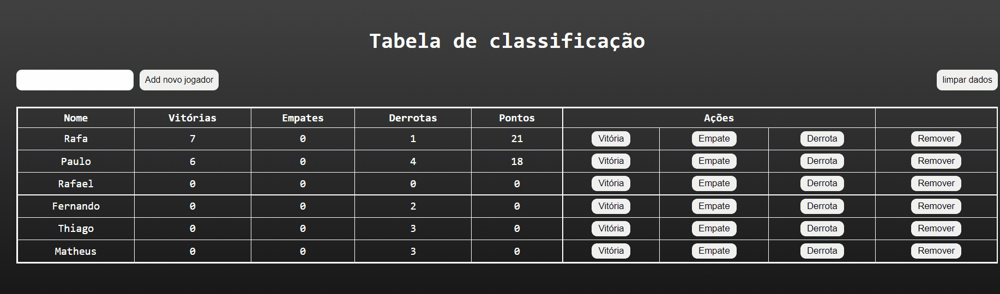

 # readme
 
 
 <h2 align="center">Tabela de Pontos</h2>

Uma tabela de pontos
com diversas funcionalidades totalmente interativa e pronta para implementar em outros projetos.

## Tabela de conteudo

   * [Gifs](#gifs)
   * [Tecnologia utilizada](#tecnologias)
   * [Como utilizar](#utilização)
   * [Veja o projeto funcionando.](#funcionando)
   * [Redes Sociais.](#rede)

   

   <h4 align="center">&#11088 Projeto tabela de pontos &#11088 </h4>
    

### feacture

 - [x] Adiciona player.
 - [x] Remove player.
 - [x] Limpa os dados da tela.
 - [x] Botões para adicionar vitorias, empates e derrotas.
 - [x] Função que calcula todos os pontos e retorna o valor para o campo pontos

  
 

  

 ## gifs
   <h3>Adiciona player</h3>  
      
    <h3>Remove player </h3> 
      
    <h3>Limpa dados da tela</h3> 
      
    <h3>Calcula pontos</h3> 
    
 
  

 
 

 
 ## tecnologias 
 
 <h2>utilizada</h2> 

 
  - HTML 
  - CSS 
  - JAVASCRIPT 
 

 

  
 

  

 ## utilização

Projeto usando apenas tecnologias de fácil utilização não necessita nenhuma instalação.

 

 

   
 

  

  ## funcionando

  
Click no botão abaixo e visualize o projeto no  codePen 

 
  <button  style="padding:8px 20px; border-radius:5px; border:none; background:black;"><a style="color:aqua;" target="_blank" href="https://codepen.io/fernandoDayCode/pen/NWMbPzb">Ir para projeto</a>
  </button>
  

   
 

  

 # Rede:    
 
 * <a target="_blank"  href="https://www.linkedin.com/feed/?trk=404_page">linkedin</a>
 * <a target="_blank"  href="https://www.instagram.com/_daycode_/">Instagram</a>
 * <a target="_blank"  href="https://www.tiktok.com/@_daycode_">TikTok</a>